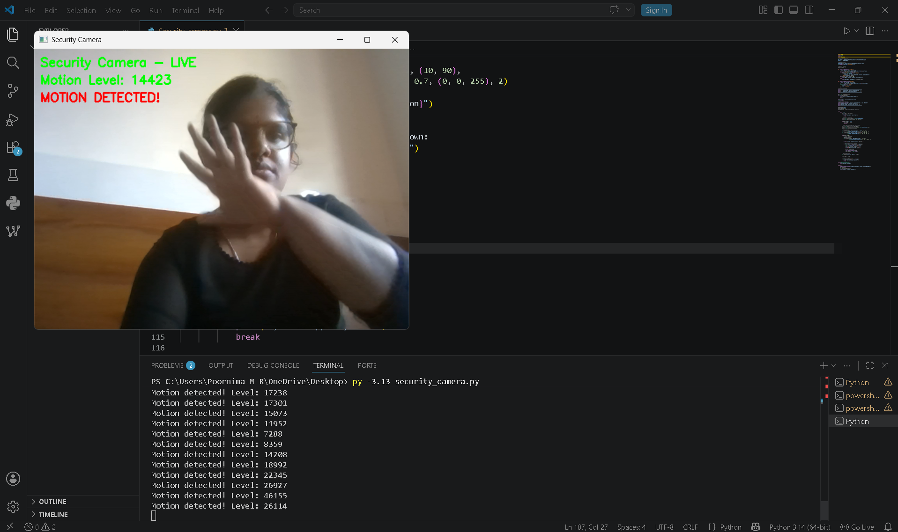
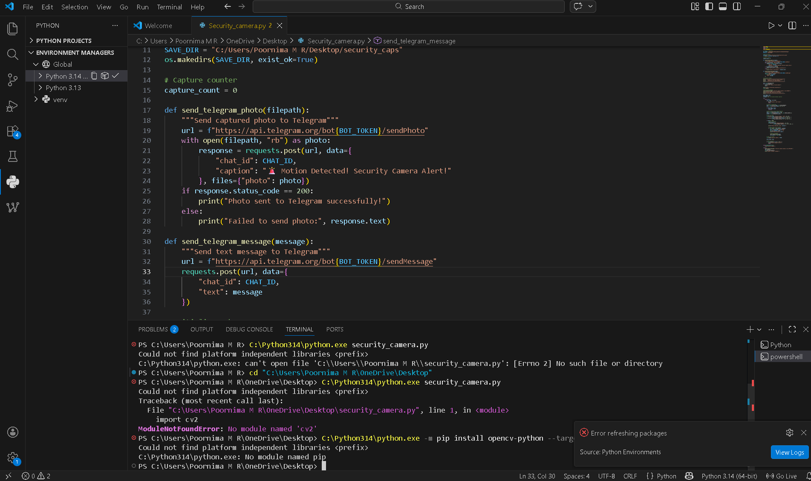
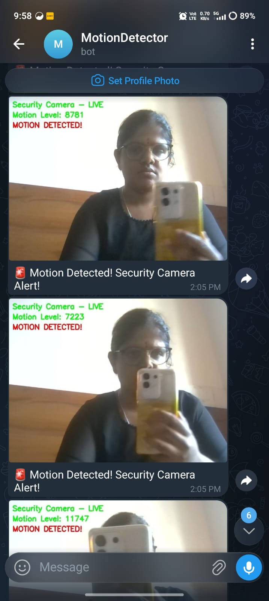

# Security Camera with Motion Detection

## Project Overview
This project simulates a Raspberry Pi Security Camera system using Python OpenCV and laptop webcam. When motion is detected through frame differencing, the system captures a photo and sends an instant alert with the photo to Telegram Bot.

## Platform
- **Simulation:** Python + Laptop Webcam
- **Original Platform:** Raspberry Pi + Pi Camera
- **Language:** Python 3.13
- **Difficulty:** Hard
- **Type:** Major Project 2 - Software Simulation

## Libraries Required
- opencv-python
- requests
- os
- time

## Install Libraries
   py -3.13 -m pip install opencv-python
   py -3.13 -m pip install requests
## How It Works
1. Laptop webcam captures live video frames
2. Each frame converted to grayscale
3. Gaussian blur applied to reduce noise
4. Frame difference calculated between current and previous frame
5. If motion pixels exceed 5000 → motion detected
6. Photo captured and saved locally
7. Photo sent to Telegram Bot instantly
8. 10 second cooldown between alerts

## How to Run
1. Install required libraries
2. Create Telegram Bot via @BotFather
3. Get your Chat ID
4. Replace BOT_TOKEN and CHAT_ID in code
5. Run: `py -3.13 security_camera.py`
6. Press Q to quit

## Features
- Live webcam feed with motion overlay
- Real-time motion level display
- Automatic photo capture on motion
- Instant Telegram alert with photo
- 10 second cooldown to prevent spam
- Startup and shutdown Telegram notifications

## Output Screenshots
### Motion Detection - Live Feed

### VS Code Terminal Output

### Telegram Alerts

## Author
**Poornima M R**
Final Year B.E. Electronics and Communication Engineering
GSSS Institute of Engineering and Technology for Women, Mysuru
VTU Affiliated | 2026 Batch

## Internship
**GlowLogics Solutions Pvt. Ltd.**
IoT Internship 2026
Major Project 2 - Software Simulation
